# 讓 Claude 幫你設計評測、爬坡優化，又不騙到自己

> 導讀對象：Lance Martin 在 claude.dev Blog 發表的〈Automating eval design and hillclimbing with Claude〉（2026-09-28）。文中的實驗數字都是 Anthropic 內部自述的結果，本文一律以「原文指出」歸屬，沒有另行獨立重現。

## 同一套設定，兩個分數

原文的例一是這樣的：一份內部客服基準測試共 44 張工單，30 張用來搜尋改法，14 張留著不給搜尋過程看。最後採用的設定，在搜尋用工單上的判斷正確率是 98.9%；換到那 14 張保留工單，只剩 90.5%（詳見第六節）。兩個分數都比起點好，差距卻不小。只看前一個數字，會高估這些改動的實際效果。

原文要處理的就是這個落差。評測（eval）能告訴你應用程式或 skill 在特定任務上的表現，可是評測要設計得可靠不容易，拿它改進系統又不被分數騙到，更不容易。Anthropic 把相關經驗整理進 `claude-api` skill，做成兩個指令：

- `/claude-api build-eval`：在你的程式碼庫裡建出一份評測。
- `/claude-api hillclimb`：用 hillclimbing（爬坡式優化）一次只改一處，對著評測往上爬，並用一組保留的測試案例抓過擬合（overfitting，也常譯為過度擬合）。

爬坡最怕兩件事：山選錯，還有以為自己往上爬了，其實只是在原地踮腳。前者出在評測本身，後者就是過擬合。本文依這條線走：先看怎麼把山量準（第一、二節），再挑路線（第三節）和防踮腳（第四節），最後看 hillclimb 怎麼爬、爬出什麼結果（第五、六節）。

## 一、好評測長什麼樣子

原文列出好評測的四個共同特徵，並用第一張圖總結。

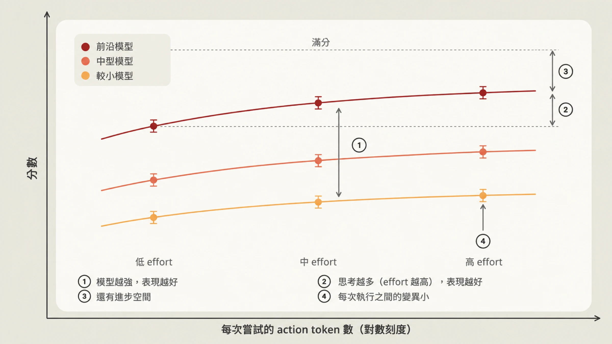

**1. 評測任務貼近正式環境。** 任務要從你在乎的實際使用情境取樣。常見的偷懶是挑好生成或好評分的任務，這樣選出來的分布，未必是你真正在乎的那一批。

**2. 模型越強、思考越多，分數就該越高。** 如果評測結果與此相反，原文的判斷是：多半有含糊的任務，或是評分器沒校準好，把表現拖了下來。

**3. 前沿有「可及」的進步空間。** 最強的模型在最高 effort 下應該遠低於 100%，否則你分不出改動的好壞。但這個差距不能靠不可能或含糊的任務撐出來，原文給的辨識線索是，某個任務不管重跑幾次都一定失敗。好任務的標準則是，兩位領域專家會得出相同判斷，而且評分器檢查的每一件事，任務裡都寫明了。

**4. 每次執行之間的變異要小。** 變異大，常見原因是任務設計含糊，或評分器對同一份輸出給出不同判定。變異也可能藏在設定裡，例如 effort 沒有被一致地套用；環境也會作怪，前一次試驗留下的檔案或 git 歷史，可能直接把答案交給 agent。

### 對抗式取樣的陷阱

取樣還有一個很容易踩的坑，第二張圖畫的就是它。

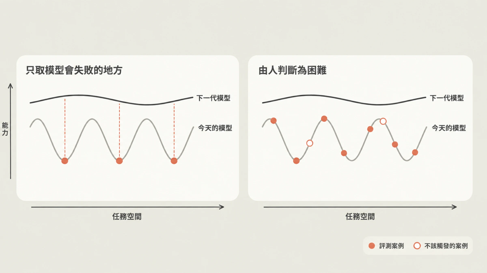

原文用「能力是鋸齒狀的」來形容模型：在任務空間裡有高有低。如果只因為「今天的模型答錯」就把某題放進評測，抽到的全是這個模型的谷底（左圖），量出來的是它的失敗指紋，跟「什麼事對你的應用真正困難或有價值」關係不大。圖中下一代模型的曲線整體畫在上方；順著這個畫法推想（導讀者的延伸，非原文用語），這些谷底可能自然消失，評測卻很難反映其他地方進步了多少。

原文的建議是：挑題的理由要是「有人判斷它難」（右圖），而且能先說出難在哪裡。從正式流量、bug 回報、工單整理出來的具體失敗都可以納入。不過也別全盤相信使用者流量，使用者常常只試自己預期會成功的東西，只從流量取樣，分布可能偏簡單。圖例裡還有一種空心圓的「不該觸發的案例」，原文沒有展開說明；導讀者的解讀是，評測也該放進一些「什麼都不該發生」的負面案例。

## 二、`/claude-api build-eval`：把原則變成訪談流程

在 Claude Code 裡執行這個指令，Claude 會先訪談你，在你的程式碼庫裡建評測，並在特定節點停下來等你核可。

**取樣順序。** 依原文列的順序：

1. 正式環境的對話紀錄（會先問資料保留與敏感資料的問題）
2. bug 回報與客服工單
3. 你親手寫的五到十個案例
4. 從你的程式碼庫合成的案例

也可以只拿少數真實範例當錨點去合成資料。skill 會產生一個簡單的頁面列出每一筆輸入，並等你確認。

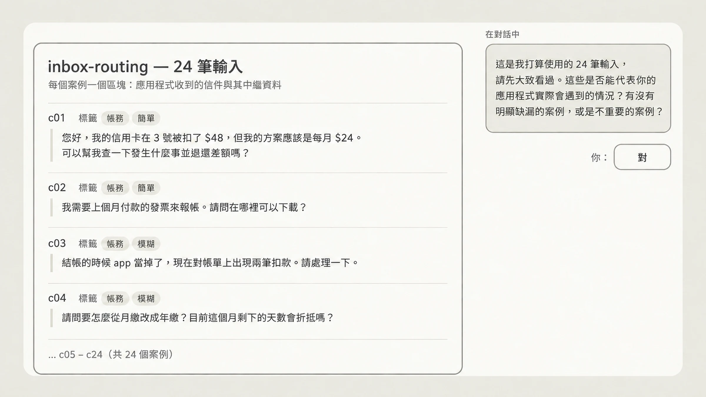

原文說明這是示意用的例子：一個信件分派（inbox-routing）應用，共 24 筆輸入，每筆帶有「帳務」「簡單」「模糊」之類的標籤。Claude 在對話裡問的是：這些輸入能不能代表你的應用實際會遇到的情況？有沒有明顯漏掉的案例，或根本不重要的案例？

**評分器要挑最便宜、能用的那種。** 原文分兩類：

- **程式化驗證。** 輸出空間受限時，用程式檢查：完全比對、固定集合裡的標籤、符合 schema 的 JSON、測試通過。
- **LLM 當評審（LLM-as-judge）。** 輸出是開放式、有很多正確答案但品質標準清楚時，預設走這條路。第二個模型讀輸入、輸出和一份 rubric，rubric 要寫成「可檢核的敘述」，不要用 1 到 5 分的量表；它回傳分數和理由。如果有基準版可比，評審會以隨機順序讀兩份輸出，並且不告訴它哪一份是基準版，再選出比較好的。評審模型由你指定，而且不該是受測的那個模型。

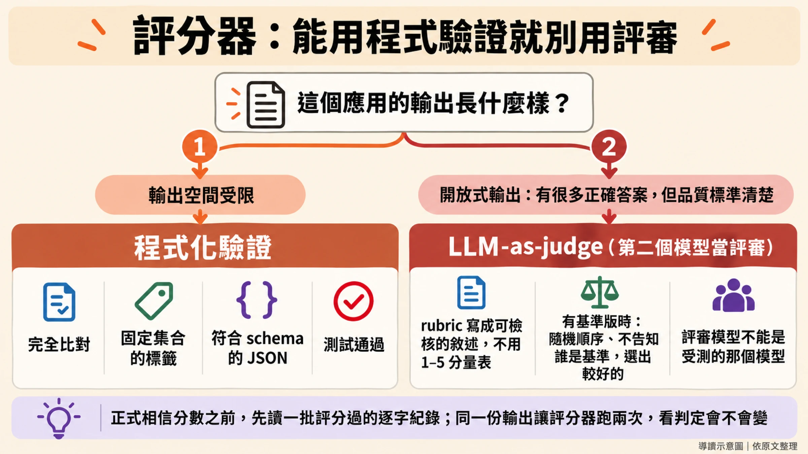

**先驗證評分器，再相信分數。** Claude 會先評幾個案例，問你有沒有哪個你會打不一樣的分數。原文強調，正式相信評分結果之前，一定要讀一批評分過的紀錄，因為評分失誤是評測設定錯誤最常見的來源之一。

驗證完評分器後，skill 會告訴你評測集的規模（案例數 × 重複次數 × 模型，以及大約要跑多久），跑出基準版，並印出附信賴區間的分數。你會拿到案例、評分器、執行器、每個案例一行 JSON 加一份完整逐字紀錄（transcript，即模型完整的輸入輸出過程），以及一個列出每個案例分數並連到其逐字紀錄的簡單頁面。想要更多（例如圖表），開口請 Claude 在旁邊多建一頁；預設這些頁面是靜態檔案，本機直接開啟，不從網路載入任何東西。

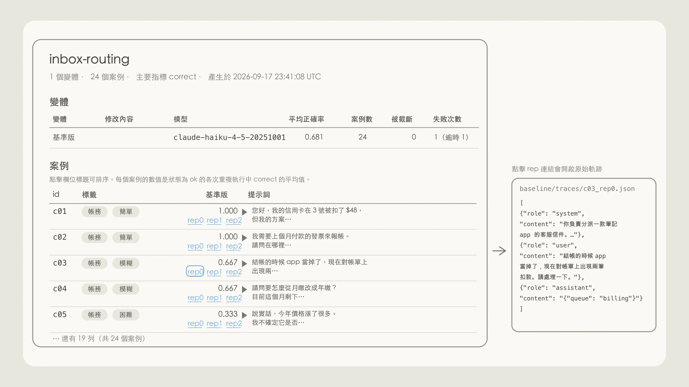

**跑基準版的同時會做三種診斷。**

- **評分器：** 對同一份輸出跑兩次，看判定有沒有改變。
- **管線：** 檢查逾時、API 錯誤和被截斷的答案，避免把基礎設施的雜訊誤當成模型的變異。
- **進步空間：** 如果基準版已經約 95% 以上，skill 會警告你，並建議把爬坡的目標轉向成本或延遲。

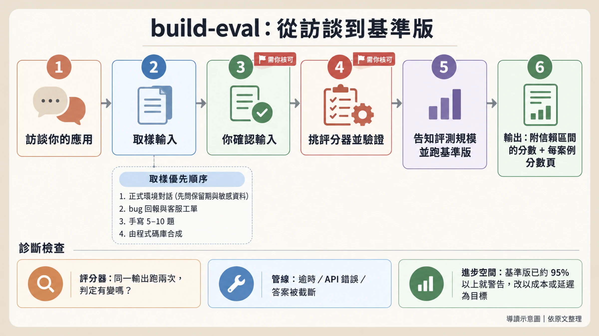

## 三、爬坡之前：先想清楚往哪裡爬

評測可靠了，就能開始改進。原文把 hillclimbing 定位成調整 effort、prompt 這類「在成本與表現之間取捨」的參數的有效方法，並給了三個選擇改進標的的準則：

- **便宜迭代。** 改動和還原的成本要低（時間、金錢、心力）。許多內部專案與客戶把爬坡集中在文字上，例如 prompt 和 skill，因為容易改也容易還原。相對地，對 agent harness 做開放式修改，可能牽動大量程式碼變更。
- **可歸因。** 分數的變化要能歸因於你正在改的標的。原文舉的例子是 skill 觸發：指標（skill 的觸發率）和被修改的 skill 描述直接連動。
- **範圍明確的目標。** 常見的失敗模式，是沒有仔細考慮評測的進步空間，就丟一句「幫我改善表現」。評測接近飽和，或標的範圍太鬆（例如「去改 harness」），都更容易停滯。成本是各種專案裡一個普遍很強的目標：就算評測已經飽和，你還是可以請 Claude 在表現持平的前提下找出降成本的方法。

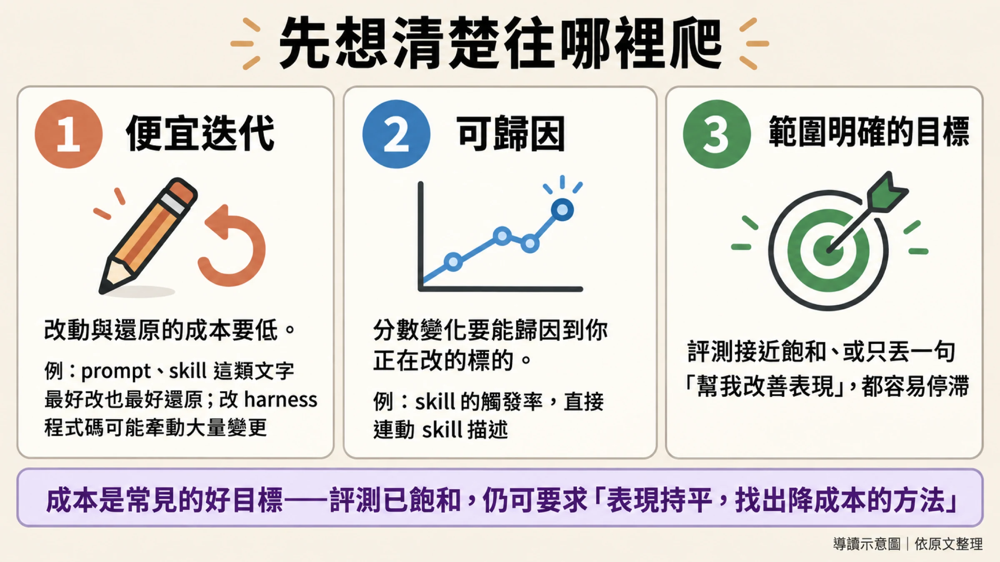

## 四、過擬合：分數升了，正式環境沒變

再好的評測，也很少剛好等於你在正式環境要面對的任務分布，所以對評測過擬合很常見：系統在評測上進步，在正式流量上沒有。

評測可以用很多方式「洩漏」進 harness（原文指的是模型周圍的程式碼，包括 prompt、工具和呼叫 Claude 的迴圈），第五張圖列了幾種常見的洩漏方式。

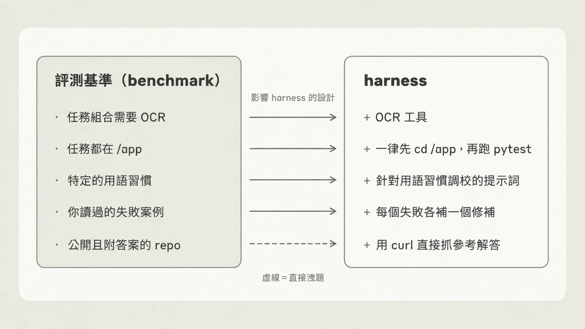

原文的例子：某個評測任務靠 OCR 才做得好，但你的正式任務很少用到 OCR。爬坡時 harness 可能因此長出一個 OCR 工具，基準測試分數上去了，對正式環境毫無影響。更廣義地說，爬坡可能替你選的那批範例的邊角案例加功能，這些功能推高評測分數，卻不會帶到正式環境。圖的最後一列（虛線）是最赤裸的洩漏：答案就放在公開 repo 上，harness 直接把參考解答抓下來。

原文給了三個對策：

1. **切分案例。** 訓練集給 hillclimber（負責提出修改的 Claude，原文的稱呼）讀，測試集永遠不讓它看到。訓練集分數上升而測試集持平，是過擬合的常見警訊。
2. **絕不把失敗內容貼進 prompt。** hillclimber 可以讀失敗的逐字紀錄，但不該把失敗內容原樣貼進 prompt。
3. **讓答案在結構上碰不到模型。** 模型有時會「reward hack」，直接找到評測的答案。

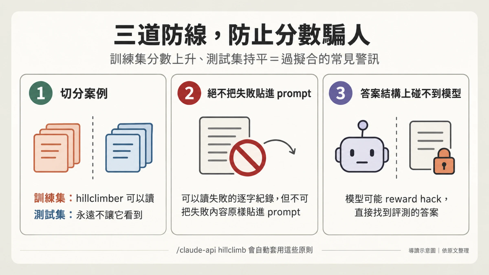

## 五、`/claude-api hillclimb`：一次改一處，兩個分數都升才留下

指令的用法：在 Claude Code 執行 `/claude-api hillclimb`，Claude 就會對著給定的評測反覆迭代。你決定它能動哪些東西：

- system prompt
- skill 或指示檔
- 工具描述
- 模型選擇、effort 與其他 API 參數
- harness 程式碼

**開始前。** Claude 會先問你要最佳化什麼（例如表現，或表現持平下的成本），然後把評測集隨機切成訓練集與測試集。如果目標是成本，它會考慮幾個常見的成本因素，包括 prompt caching、檢查 prompt 和所選模型是否相容，以及挑模型與 effort。第一輪之前，它還會檢查評測的雜訊（分數單憑機率能晃多遠）是否小於你願意採取行動的最小進步；如果不是，它會直說，並建議增加重複次數或案例數。

**每一輪**的流程如圖六。

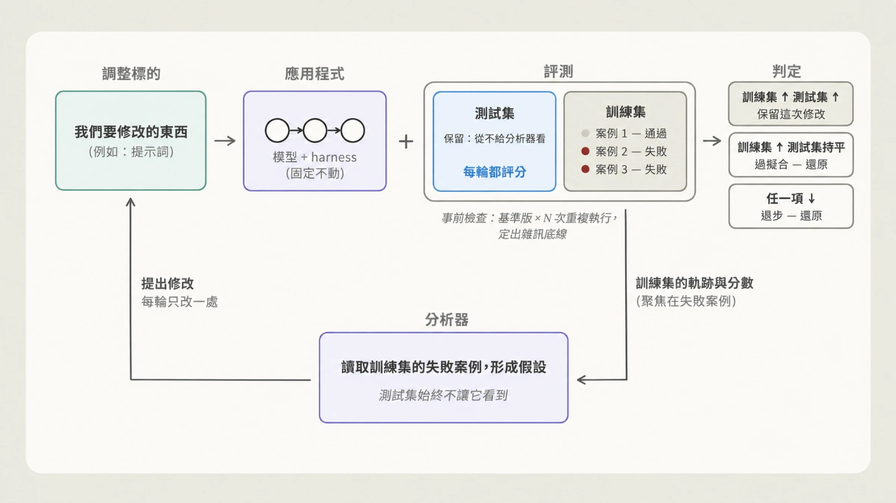

Claude 讀上一輪的訓練集逐字紀錄，提出一個以 patch 形式呈現的修改，再用修改後的版本重跑評測。它瞄準的是效果能超出評測雜訊的修改：從根本修好失敗行為（例如改寫造成問題的段落、補上缺少的規則），換個說法改一行字不算。判定規則有三條：

- 訓練集進步、測試集持平：懷疑過擬合，還原。
- 有退步：還原。
- 訓練集與測試集都進步：保留。

**卡關時。** 分數停滯兩三輪，Claude 會逐一讀剩下的訓練集失敗案例，依成因分類。如果任何單一修正都不可能贏過評測雜訊，它會提早做同樣的事，並建議增加重複次數或案例，免得把回合花在小到量不出來的修改上。這個步驟能揪出含糊的評測案例、harness 錯誤，或是單純的每次執行變異。只有確實合理的失敗，才會進入後續回合。

**收尾。** 爬坡結束時，Claude 會讓你的程式碼停在「對你的目標而言測試集表現最好」的版本，回報測試結果對比基準版的差距與信賴區間。如果增益落在雜訊範圍內，它會明說，並建議不要合併。

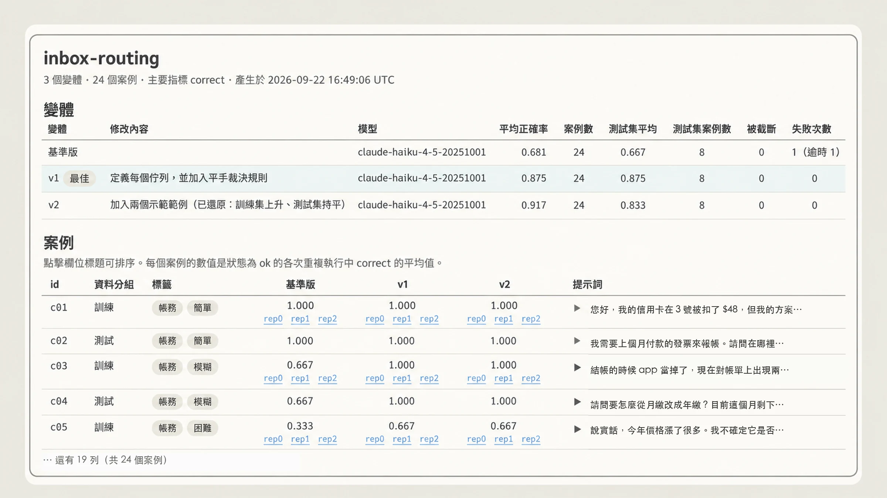

原文附了一張示意性的報告頁（原文標註為 schematic，數字屬於示意，並非實測結果）：假設基準版平均 0.681（測試集 0.667），v1「定義每個佇列並加入平手裁決規則」拉到 0.875，測試集同樣是 0.875，被標為最佳。v2 又「加入兩個示範範例」，平均升到 0.917，測試集卻只有 0.833，也就是整體上升、測試集沒跟上，因此被還原。只看平均，v2 看起來最好；有了測試集，才看得出這次修改可能只是貼合了搜尋時看過的案例。要提醒的是，示意圖裡的測試集只有 8 個案例，0.875 與 0.833 只差一個案例，這裡拿它說明規則，不能當成統計證據。

## 六、兩個實例

### 例一：降成本，同時改善表現

原文在一份內部客服基準測試上跑了 `hillclimb`，目標是降低成本並提升表現。基準包含 44 張工單，其中 30 張用於搜尋，14 張保留。起點是 Opus 4.8、預設（high）effort，在搜尋用工單上判斷正確率 74.4%，每張工單的 token 成本 4.6 美分。

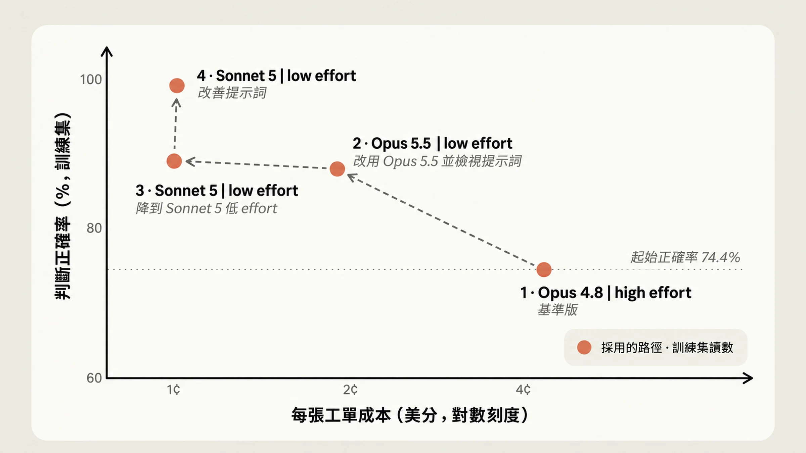

依原文，路徑分四步：

1. **先檢視 prompt。** 移除強制的工具呼叫儀式、草稿步驟，以及互相矛盾的規則。
2. **改用 Opus 5.5、low effort。** 正確率 87.8%，超過起點的 74.4%，成本降到每張 1.9 美分，不到起點的一半。原文說明部分節省來自 Opus 5.5 的定價：輸入與輸出 token 比 Opus 4.8 便宜 20%，cache 讀取便宜 60%（此定價為原文說法，本文未獨立查證）。
3. **再降一級，試 Sonnet 5、low effort。** 因為 Opus 5.5 已過關，hillclimb 接著檢查更便宜的模型行不行。結果 88.9%，成本約 1 美分，約為前一步的一半。
4. **改善 prompt。** 加入分派規則與退款上限的交叉引用，Sonnet 5 在搜尋用工單上到 98.9%，成本差不多。

最後要看清楚的是保留工單。在 14 張搜尋過程從未見過的保留工單上，最終設定得 90.5%，原始設定是 78.6%，成本約為五分之一。圖八的「近 100%」是搜尋用工單（圖中標為訓練集）的讀數，適合拿來看爬坡的過程；對外的結論要看保留工單的數字。另有兩點要保守看待：原文沒有附這組數字的信賴區間，14 張的樣本也很小；原文也沒有說明這 14 張保留工單與 hillclimb 內部切分出的測試集是什麼關係。

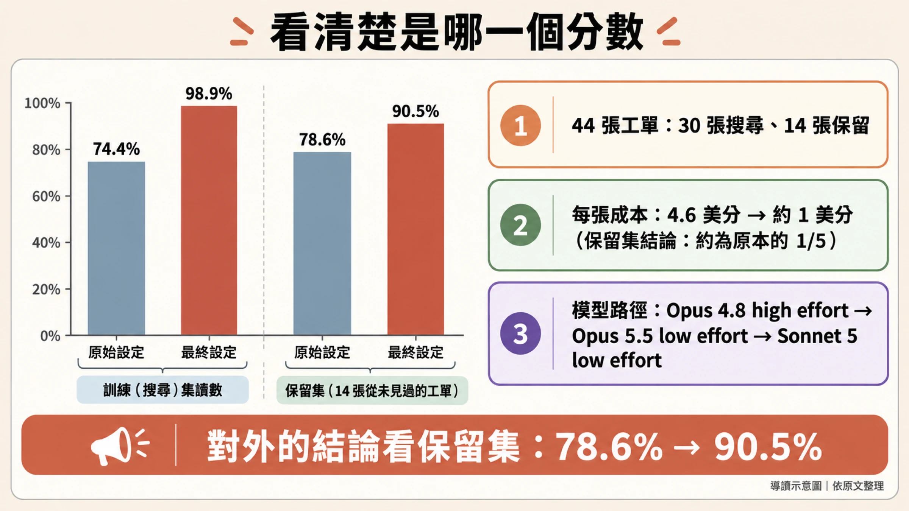

### 例二：提升表現（claude-api skill 自己）

第二個例子是 `claude-api` skill 本身。這個 skill 負責提供使用 Anthropic API 的指引與使用 Claude 的通用建議，包括本文談的子指令。團隊希望它能寫出正確使用 API 的程式碼，所以從文件衍生出一份評測集來測 skill。

評測起點是 66%。團隊讓 hillclimber 能存取文件與 SDK，好讓 Claude 自己找錯、自己修正。

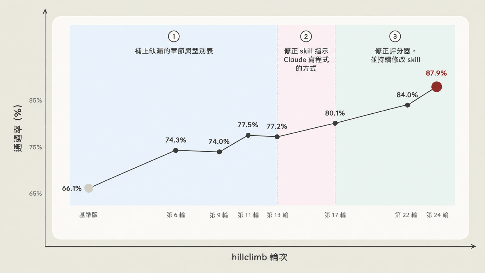

原文的過程分四段：

- **補缺漏。** Claude 發現 skill 漏掉八個功能的內容。補上這些章節後升到 74%；接著又找到 C# 與 Java 型別表的錯誤，升到 77%。
- **停滯後的「反思」步驟。** 分數停滯兩輪後，進入第五節說的分類步驟：不改任何東西，只把剩下的失敗依成因分類。
- **發現真正的問題。** 跨失敗案例回頭看，hillclimber 發現 skill 的內容其實在，問題是 Claude 寫出的是舊版 API 的形狀，源自它訓練時學到的先驗。對策是在 skill 靠前的位置加一張對照表，引導 Claude 從記得的舊寫法轉到現行寫法：例如固定 token 預算的 extended thinking（最近的 Opus 模型在 API 上已經拒絕這種用法）換成 adaptive thinking，以及舊版的網頁搜尋與網頁抓取工具換成現行版本。它也把 C# 與 Java 中反對固定預算 thinking 的警告，移到 adaptive thinking 範例之前。這一輪升到 80%。
- **輪到修評測本身。** 原文給了一個判斷準則：明明補了顯而易見的內容缺口，卻一直沒進步的任務，是範例或評分器有問題的徵兆。有個任務要求寫出只捕捉一種錯誤的程式，評分器要的卻是一條至少三個的鏈（原文只有這一句，細節沒有展開）；另一個評分器的指示與文件互相矛盾，實測真實 API 後發現文件才是對的。Claude 改寫了任務、修正評分器，再加上更多 skill 修改，最後到約 88%（圖為第 24 輪 87.9%）。這一段同時混著修評分器與改 skill，原文沒有拆開兩者各占多少。

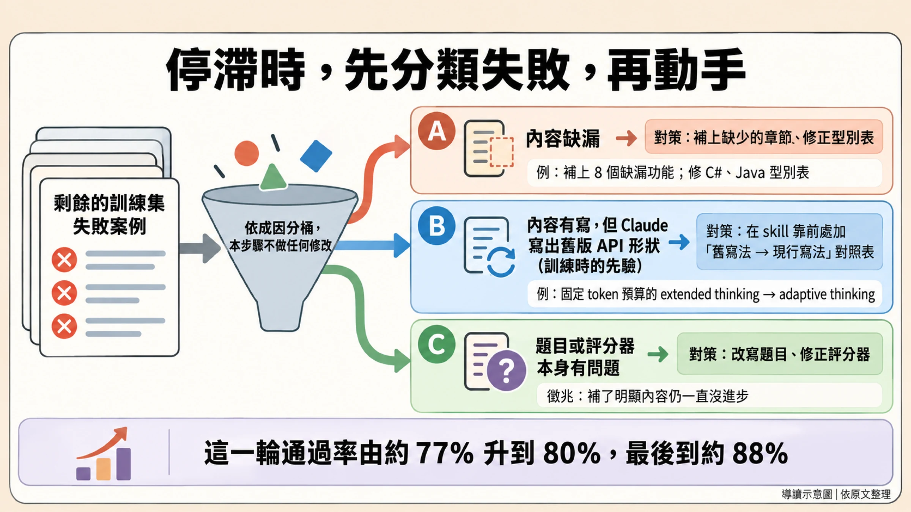

## 七、收束：分數之外，評測本身也要驗

如果只留一個觀念，兩個實例共同指向的是：評測本身也會出錯，要先驗過才值得爬。例一靠保留工單看出搜尋用工單讀數的水分；例二靠停滯後的失敗分類，才發現有題目與評分器互相矛盾。下面這張檢查表是導讀者依全文整理的，只有「放一些不該觸發的案例」是導讀者自己的延伸，其餘都出自原文各節。下次替自己的應用做評測與爬坡，可以拿來對照。

要上手，直接在 Claude Code 執行 `/claude-api build-eval`（可提供 traces 之類的範例當引導，範例與評分器都要經你核可），或在已有評測時執行 `/claude-api hillclimb` 並指定目標，例如更好的表現，或表現持平下更低的成本。

## 來源

**主要來源（官方、第一手）**

- Lance Martin，〈Automating eval design and hillclimbing with Claude〉，claude.dev Blog，2026-09-28：<https://claude.dev/blog/automating-eval-design-and-hillclimbing/>。本文所有數字、流程與引述皆出自此文；文中九張圖為該文原圖，本文將圖內文字翻譯為台灣用語繁體中文並保留數值。原文標註圖 3、圖 4、圖 7 為示意（schematic／illustration），圖中數字並非實測。

**查證說明**

- 原文的實驗數據（44 張工單的成本案例、claude-api skill 的 66%→88%）為 Anthropic 內部自述結果，沒有公開的獨立重現。
- 原文以「我們」（Anthropic）的口吻撰寫，同時是自家 claude-api skill 的使用指南，文中比較的也是 Anthropic 自家模型，讀者宜自行斟酌。
- Opus 5.5 相對 Opus 4.8 的 token 定價差異（輸入輸出便宜 20%、cache 讀取便宜 60%）為原文說法，本文未另行查證。
